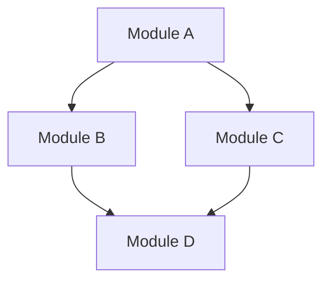

# Modular Monolith

Modular Monolith is an architectural pattern that combines the simplicity of a monolith with the organizational benefits of microservices. It is a single deployable unit (monolith) but is internally structured as a set of independent modules that communicate through well-defined interfaces.

## Why Modular Monolith?

- **Simplicity**: Easier to develop, test, and deploy than microservices
- **Performance**: No network latency between modules
- **Maintainability**: Modules can be developed and maintained independently
- **Scalability**: Modules can be scaled independently
- **Flexibility**: Modules can be extracted into microservices later if needed

## Key Concepts

- **Modules**: Independent units of code that handle specific business capabilities
- **Interfaces**: Well-defined contracts between modules
- **Dependencies**: Modules should have minimal dependencies on each other
- **Communication**: Modules communicate through interfaces, not direct dependencies
- **Deployment**: Single deployable unit

## Benefits

- **Faster development**: Modules can be developed independently
- **Easier testing**: Modules can be tested independently
- **Simpler deployment**: Single deployable unit
- **Better performance**: No network latency between modules
- **Improved maintainability**: Modules can be maintained independently
- **Scalability**: Modules can be scaled independently
- **Flexibility**: Modules can be extracted into microservices later if needed

## Drawbacks

- **Complexity**: More complex than a traditional monolith
- **Testing**: Testing can be more complex than a traditional monolith
- **Deployment**: Deployment can be more complex than a traditional monolith
- **Performance**: Performance can be impacted by module communication
- **Maintainability**: Maintainability can be impacted by module dependencies
- **Scalability**: Scalability can be impacted by module dependencies
- **Flexibility**: Flexibility can be impacted by module dependencies

## When to Use

- **Small to medium-sized applications**: 10-50 modules
- **Applications with clear boundaries**: Modules with well-defined responsibilities
- **Applications with evolving requirements**: Modules can be extracted into microservices later if needed
- **Applications with limited resources**: Simpler to develop and maintain than microservices

## When Not to Use

- **Large-scale applications**: More than 50 modules
- **Applications with complex boundaries**: Modules with unclear responsibilities
- **Applications with stable requirements**: Modules can be extracted into microservices later if needed
- **Applications with limited resources**: Simpler to develop and maintain than microservices

## Architecture



## Example

```csharp
// Module A
public interface IModuleA
{
    void DoSomething();
}

// Module B
public interface IModuleB
{
    void DoSomethingElse();
}

// Module C
public interface IModuleC
{
    void DoSomethingElseAgain();
}

// Module D
public interface IModuleD
{
    void DoSomethingElseAgainAndAgain();
}
```

## Conclusion

Modular Monolith is a great architectural pattern for small to medium-sized applications with clear boundaries and evolving requirements. It provides the benefits of both monoliths and microservices while avoiding many of their drawbacks.

## Resources

- [Modular Monolith Architecture](https://www.youtube.com/watch?v=j6s91_60_6s)
- [Modular Monolith Pattern](https://www.youtube.com/watch?v=j6s91_60_6s)
- [Modular Monolith Pattern](https://www.youtube.com/watch?v=j6s91_60_6s)

## License

This work is licensed under a Creative Commons Attribution-NonCommercial-ShareAlike 4.0 International License.

## Feedback

If you have any feedback or suggestions, please feel free to open an issue or submit a pull request.